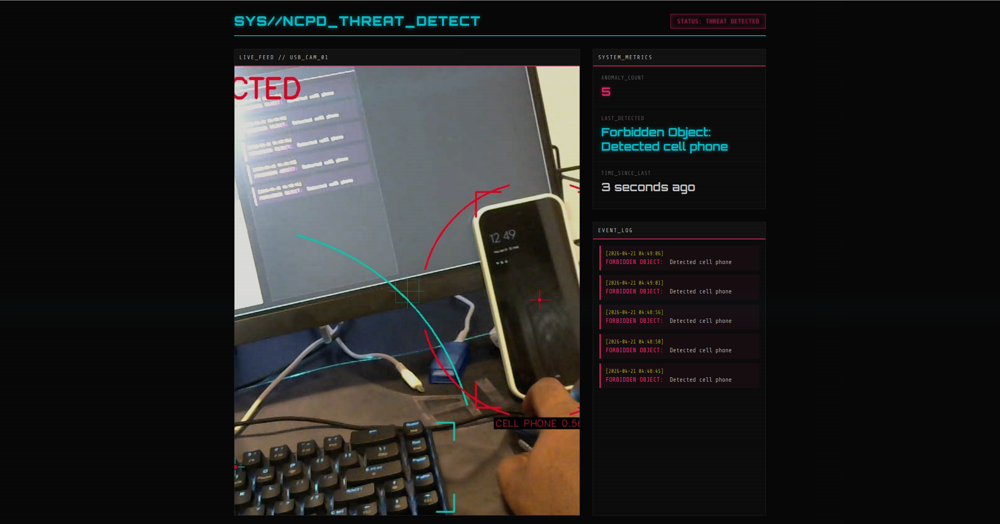
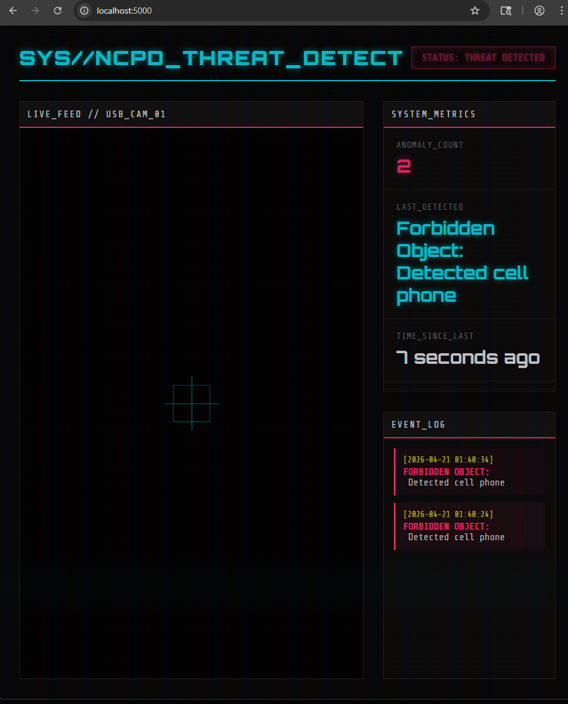

# Real-Time Anomaly Detection System (Jetson Orin Nano)

## Overview

This project implements a real-time anomaly detection system using NVIDIA Jetson Orin Nano and object detection.

The system detects unusual conditions such as:

* Too many people in frame
* Forbidden objects (e.g., cell phone)

A Cyberpunk-style UI displays live results with anomaly logs and statistics.

---

## Approach

### Object Detection

* Model: SSD-Mobilenet-v2 (Jetson Inference)
* Input: USB Camera (/dev/video0)

### Anomaly Logic

* Count-based rule:

  * Trigger if people > 2
* Forbidden object:

  * Detect "cell phone" or "backpack"

### System Pipeline

Camera → detectNet → Rule Engine → UI + Logging

---

## 🖥️ UI Features

* Live video stream (Flask MJPEG)
* Cyberpunk-themed dashboard
* Real-time:

  * anomaly count
  * last anomaly
  * time since last detection
* Event log panel

---

## Results

### Anomaly Detection Example



### Full System UI



---

## Output

* anomaly_log.csv → stores timestamped anomalies

Example:
Timestamp, Anomaly_Type, Details
2026-04-21, Forbidden Object, Detected cell phone

---

## How to Run

```bash
python3 app.py
```

Open browser:

```
http://<jetson-ip>:5000
```

---

## Key Highlights

* Real-time GPU inference on Jetson
* Rule-based anomaly detection
* Custom Cyberpunk UI
* Logging + cooldown system

---
* Alert system (email/notification)
